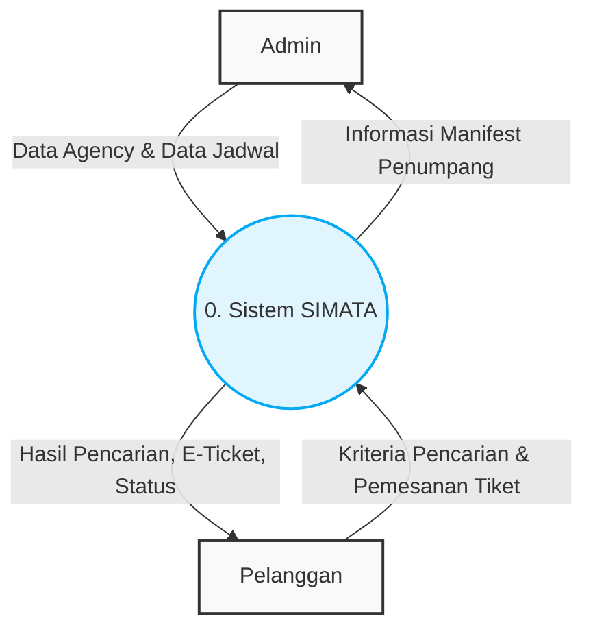
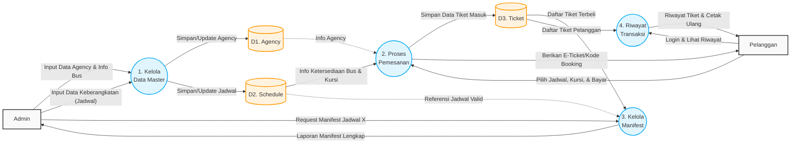

### 1. DFD Level 0 (Context Diagram)

```mermaid
graph TD
    classDef entity fill:#f9f9f9,stroke:#333,stroke-width:2px;
    classDef process fill:#e1f5fe,stroke:#03a9f4,stroke-width:2px;

    Admin[Admin]:::entity
    Pelanggan[Pelanggan]:::entity
    
    Sistem((0. Sistem SIMATA)):::process

    Admin -- "Data Agency & Data Jadwal" --> Sistem
    Sistem -- "Informasi Manifest Penumpang" --> Admin

    Pelanggan -- "Kriteria Pencarian & Pemesanan Tiket" --> Sistem
    Sistem -- "Hasil Pencarian, E-Ticket, Status" --> Pelanggan
```

 

### 2. DFD Level 1

```mermaid
graph LR
    classDef entity fill:#f9f9f9,stroke:#333,stroke-width:2px;
    classDef process fill:#e1f5fe,stroke:#03a9f4,stroke-width:2px;
    classDef store fill:#fff3e0,stroke:#ff9800,stroke-width:2px;

    Admin[Admin]:::entity
    Pelanggan[Pelanggan]:::entity

    P1((1. Kelola <br/>Data Master)):::process
    P2((2. Proses <br/>Pemesanan)):::process
    P3((3. Kelola <br/>Manifest)):::process
    P4((4. Riwayat <br/>Transaksi)):::process

    D1[(D1. Agency)]:::store
    D2[(D2. Schedule)]:::store
    D3[(D3. Ticket)]:::store

    Admin -- "Input Data Agency & Info Bus" --> P1
    Admin -- "Input Data Keberangkatan (Jadwal)" --> P1
    P1 -- "Simpan/Update Agency" --> D1
    P1 -- "Simpan/Update Jadwal" --> D2

    Pelanggan -- "Pilih Jadwal, Kursi, & Bayar" --> P2
    D1 -. "Info Agency" .-> P2
    D2 -- "Info Ketersediaan Bus & Kursi" --> P2
    P2 -- "Simpan Data Tiket Masuk" --> D3
    P2 -- "Berikan E-Ticket/Kode Booking" --> Pelanggan

    Admin -- "Request Manifest Jadwal X" --> P3
    D2 -. "Referensi Jadwal Valid" .-> P3
    D3 -- "Daftar Tiket Terbeli" --> P3
    P3 -- "Laporan Manifest Lengkap" --> Admin

    Pelanggan -- "Login & Lihat Riwayat" --> P4
    D3 -- "Daftar Tiket Pelanggan" --> P4
    P4 -- "Riwayat Tiket & Cetak Ulang" --> Pelanggan
```
