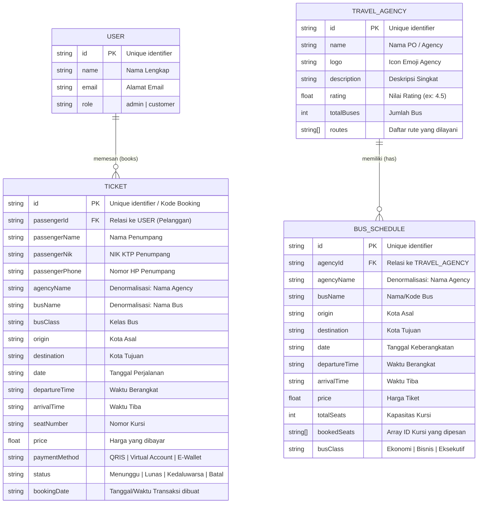

```mermaid
erDiagram
    %% Entitas
    USER {
        string id PK "Unique identifier"
        string name "Nama Lengkap"
        string email "Alamat Email"
        string role "admin | customer"
    }

    TRAVEL_AGENCY {
        string id PK "Unique identifier"
        string name "Nama PO / Agency"
        string logo "Icon Emoji Agency"
        string description "Deskripsi Singkat"
        float rating "Nilai Rating (ex: 4.5)"
        int totalBuses "Jumlah Bus"
        string[] routes "Daftar rute yang dilayani"
    }

    BUS_SCHEDULE {
        string id PK "Unique identifier"
        string agencyId FK "Relasi ke TRAVEL_AGENCY"
        string agencyName "Denormalisasi: Nama Agency"
        string busName "Nama/Kode Bus"
        string origin "Kota Asal"
        string destination "Kota Tujuan"
        string date "Tanggal Keberangkatan"
        string departureTime "Waktu Berangkat"
        string arrivalTime "Waktu Tiba"
        float price "Harga Tiket"
        int totalSeats "Kapasitas Kursi"
        string[] bookedSeats "Array ID Kursi yang dipesan"
        string busClass "Ekonomi | Bisnis | Eksekutif"
    }

    TICKET {
        string id PK "Unique identifier / Kode Booking"
        string passengerId FK "Relasi ke USER (Pelanggan)"
        string passengerName "Nama Penumpang"
        string passengerNik "NIK KTP Penumpang"
        string passengerPhone "Nomor HP Penumpang"
        string agencyName "Denormalisasi: Nama Agency"
        string busName "Denormalisasi: Nama Bus"
        string busClass "Kelas Bus"
        string origin "Kota Asal"
        string destination "Kota Tujuan"
        string date "Tanggal Perjalanan"
        string departureTime "Waktu Berangkat"
        string arrivalTime "Waktu Tiba"
        string seatNumber "Nomor Kursi"
        float price "Harga yang dibayar"
        string paymentMethod "QRIS | Virtual Account | E-Wallet"
        string status "Menunggu | Lunas | Kedaluwarsa | Batal"
        string bookingDate "Tanggal/Waktu Transaksi dibuat"
    }

    %% Definisi Relasi
    TRAVEL_AGENCY ||--o{ BUS_SCHEDULE : "memiliki (has)"
    USER ||--o{ TICKET : "memesan (books)"
```
