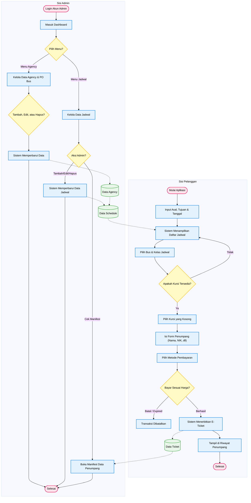

```mermaid
flowchart TD
    %% Styling
    classDef startend fill:#fce4ec,stroke:#e91e63,stroke-width:2px;
    classDef process fill:#e3f2fd,stroke:#1e88e5,stroke-width:2px;
    classDef condition fill:#fff9c4,stroke:#fbc02d,stroke-width:2px;
    classDef database fill:#e8f5e9,stroke:#4caf50,stroke-width:2px;

%%{init: {'theme':'base','themeVariables': {
  'primaryTextColor': '#000000'
}}}%%

    %% --------------------------------
    %% 🎫 FLOW PELANGGAN (CUSTOMER)
    %% --------------------------------
    subgraph Sisi Pelanggan
        C_Start([Mulai Aplikasi]):::startend --> C_Search
        C_Search["Input Asal, Tujuan & Tanggal"]:::process --> C_Find
        C_Find["Sistem Menampilkan Daftar Jadwal"]:::process --> C_ChooseBus
        C_ChooseBus["Pilih Bus & Kelas Jadwal"]:::process --> C_CheckSeats
        
        C_CheckSeats{"Apakah Kursi Tersedia?"}:::condition
        C_CheckSeats -- Tidak --> C_Find
        C_CheckSeats -- Ya --> C_PickSeat
        
        C_PickSeat["Pilih Kursi yang Kosong"]:::process --> C_FormData
        C_FormData["Isi Form Penumpang (Nama, NIK, dll)"]:::process --> C_SelectPayment
        C_SelectPayment["Pilih Metode Pembayaran"]:::process --> C_Pay
        
        C_Pay{"Bayar Sesuai Harga?"}:::condition
        C_Pay -- Batal / Expired --> C_Fail["Transaksi Dibatalkan"]:::process
        C_Pay -- Berhasil --> C_GenTicket
        
        C_GenTicket["Sistem Menerbitkan E-Ticket"]:::process -.-> DB_TICKET
        C_GenTicket --> C_History["Tampil di Riwayat Penumpang"]:::process
        C_History --> C_End([Selesai]):::startend
    end

    %% --------------------------------
    %% 👨‍💼 FLOW ADMIN
    %% --------------------------------
    subgraph Sisi Admin 
        A_Start([Login Akun Admin]):::startend --> A_Dash["Masuk Dashboard"]:::process
        A_Dash --> A_Menu{"Pilih Menu?"}:::condition
        
        A_Menu -- Menu Agency --> A_Agency["Kelola Data Agency & PO Bus"]:::process
        A_Agency --> A_ActionAgency{"Tambah, Edit, atau Hapus?"}:::condition
        A_ActionAgency --> A_SaveAgency["Sistem Memperbarui Data"]:::process
        A_SaveAgency -.-> DB_AGENCY[(Data Agency)]:::database
        A_SaveAgency --> A_End([Selesai]):::startend
        
        A_Menu -- Menu Jadwal --> A_Schedule["Kelola Data Jadwal"]:::process
        A_Schedule --> A_ActionSched{"Aksi Admin?"}:::condition
        
        %% Admin Schedule Actions
        A_ActionSched -- Tambah/Edit/Hapus --> A_SaveSched["Sistem Memperbarui Data Jadwal"]:::process
        A_SaveSched -.-> DB_SCHEDULE[(Data Schedule)]:::database
        A_SaveSched --> A_End
        
        A_ActionSched -- Cek Manifest --> A_Manifest["Buka Manifest Data Penumpang"]:::process
        
        %% Database Relationship Lines
        DB_AGENCY -.-> DB_SCHEDULE
        DB_SCHEDULE -.-> C_Find
        DB_TICKET[(Data Ticket)]:::database -.-> A_Manifest
        
        A_Manifest --> A_End
    end
```