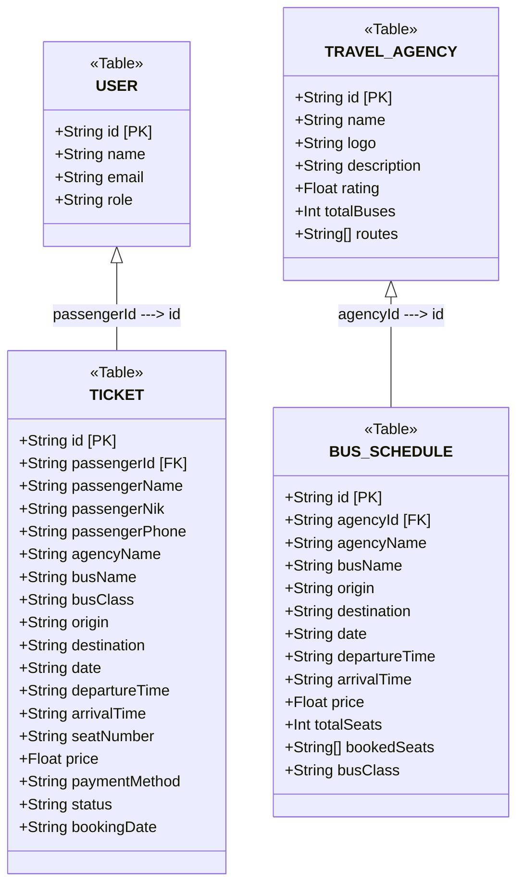

```mermaid
classDiagram
    %% LRS Representation using Class Diagram for detailed Table view
    
    class USER {
        <<Table>>
        +String id [PK]
        +String name
        +String email
        +String role
    }
    
    class TRAVEL_AGENCY {
        <<Table>>
        +String id [PK]
        +String name
        +String logo
        +String description
        +Float rating
        +Int totalBuses
        +String[] routes
    }
    
    class BUS_SCHEDULE {
        <<Table>>
        +String id [PK]
        +String agencyId [FK]
        +String agencyName
        +String busName
        +String origin
        +String destination
        +String date
        +String departureTime
        +String arrivalTime
        +Float price
        +Int totalSeats
        +String[] bookedSeats
        +String busClass
    }
    
    class TICKET {
        <<Table>>
        +String id [PK]
        +String passengerId [FK]
        +String passengerName
        +String passengerNik
        +String passengerPhone
        +String agencyName
        +String busName
        +String busClass
        +String origin
        +String destination
        +String date
        +String departureTime
        +String arrivalTime
        +String seatNumber
        +Float price
        +String paymentMethod
        +String status
        +String bookingDate
    }

    %% LRS Relationships (Mapping FK to PK)
    TRAVEL_AGENCY <|-- BUS_SCHEDULE : agencyId ---> id
    USER <|-- TICKET : passengerId ---> id
```
